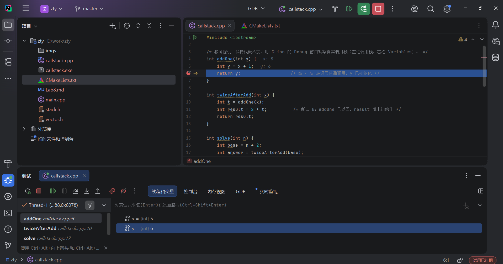
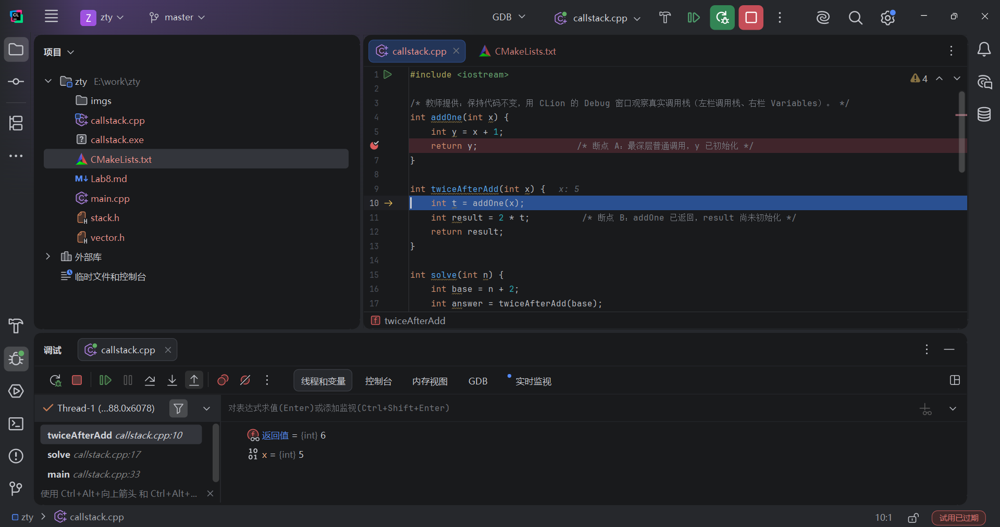
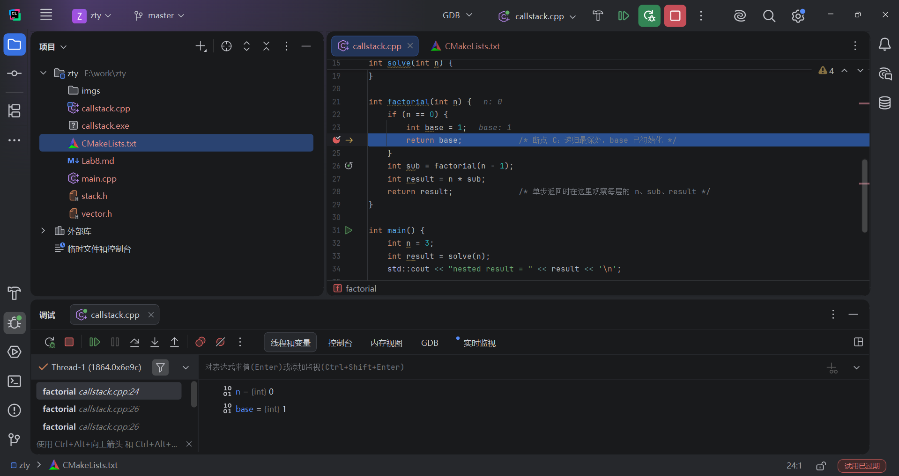

# Lab8：从 Vector<T> 派生 Stack<T>——括号匹配与函数调用栈

> **作业目标**：阅读教师提供的顺序表头文件 `vector.h`，按邓俊辉《数据结构（C++ 语言版）》的方式派生 `Stack<T>`，用自己实现的栈完成括号匹配，再用 CLion 追踪普通嵌套调用与递归调用中的入栈、返回和出栈。
>
> 本次提供完整的顺序表、统一测试和调用栈演示程序；学生完成 **`stack.h` 的三个成员函数和 `main.cpp` 的 `paren` 函数**，并填写观察记录。代码采用课本的 `Vector<T>`、`Stack<T>`、`Rank`、`_size`、`_capacity`、`_elem` 等命名，是面向本实验的教学子集，并非教材全部源码。

---

## 一、文件与运行目标

将 `homework/Lab8/` 中以下 **6 个文件**复制到自己的 `学号姓名/Lab8/`，在个人目录中完成作业。

| 文件 | 用途 | 学生需要完成的内容 |
| :--- | :--- | :--- |
| [vector.h](vector.h) | 已写好的顺序表模板 | 阅读，不修改 |
| [stack.h](stack.h) | 从顺序表派生的栈模板 | 补全三处 `TODO` |
| [main.cpp](main.cpp) | 括号匹配与统一测试 | 补全 `paren` 的一处 `TODO` |
| [callstack.cpp](callstack.cpp) | 普通嵌套调用与递归演示 | 不修改，使用 CLion 调试 |
| [CMakeLists.txt](CMakeLists.txt) | 两个独立程序的构建配置 | 原样保留 |
| `Lab8.md` | 实验说明与报告 | 填写第五、六节 |

在 CLion 中打开自己 `Lab8` 目录里的 `CMakeLists.txt`，选择 **Open as Project**（或通过 Open 打开该目录），重新加载 CMake。设置 CMake Profile 的 **Build type 为 Debug**。两个运行目标分别是：

| 目标 | 源文件 | 用途 |
| :--- | :--- | :--- |
| `lab8_stack` | `main.cpp` | 检查栈与括号匹配，运行 15 组固定测试 |
| `lab8_callstack` | `callstack.cpp` | 观察程序运行时的调用栈 |

两个 `.cpp` 各有一个 `main`，必须分别构建为两个目标，不能放进同一个 `add_executable`。头文件通过 `#include` 引入，不单独编译。全部代码使用 C++17。

学生待补的四个函数只保留注释和空函数体，不提供占位返回值。未补完时，非 `void` 函数缺少返回语句，编译器可能警告或报错；即使编译通过也不能运行 `lab8_stack`。请完成四处代码后再构建、运行该目标。`lab8_callstack` 是独立目标，可以先单独构建和调试。

## 二、阅读已完成的顺序表 vector.h

### 2.1 从 Lab5 的整数向量到课本风格

Lab5 自己管理 `int` 动态数组；这次教师提供的 `Vector<T>` 已经完成同样的存储工作，并把元素类型改为模板参数。先读懂以下成员，再写栈。

| 成员 | 含义 |
| :--- | :--- |
| `typedef int Rank` | 用整数表示元素的秩，即从 `0` 开始的下标 |
| `_size` | 当前有效元素个数 |
| `_capacity` | 动态数组的总容量，默认初始值为 `3` |
| `_elem` | 指向动态数组的指针 |
| `expand()` | 满时申请两倍容量，复制有效元素，再释放旧数组 |

这些数据和 `expand()` 位于 `private` 区域，只有 `Vector` 自己的成员函数可以直接访问；`Stack` 和普通使用者都通过 `public` 接口操作。有效元素只在 `[0, _size)` 内，备用空间不是有效元素。

### 2.2 本实验提供的接口

| 接口 | 约定 |
| :--- | :--- |
| `Vector<T> V;` | 构造空表，容量为 `3` |
| `Vector<T> V(c);` | 指定初始容量；`c <= 0` 时改用 `3` |
| `size()` / `empty()` / `capacity()` | 查询有效元素个数、是否为空和容量 |
| `operator[](r)` | 返回第 `r` 个元素的引用；要求 `0 <= r < size()`，提供可写与只读版本 |
| `find(e)` | 从后向前查找，返回最后一次出现的秩；不存在时返回 `-1` |
| `insert(r, e)` | 在秩 `r` 处插入，原来从 `r` 开始的元素右移；要求 `0 <= r <= size()`，返回插入位置 |
| `insert(e)` | 在末尾追加，返回插入位置 |
| `remove(r)` | 删除并返回第 `r` 个元素；要求 `0 <= r < size()` |
| `remove(lo, hi)` | 删除左闭右开区间 `[lo, hi)`，返回删除个数；要求 `0 <= lo <= hi <= size()` |

注意两种 `remove` 的返回值不同：单位置版本返回**被删元素**，区间版本返回**删除个数**。

本版删除时不缩容；删除末元素无需移动其他元素。顺序表接口按上表的合法秩和区间工作，由调用者保证这些条件成立；接口内部不检查越界，也不约定非法调用的返回值。

为了集中学习栈，本版不包含排序、去重与深拷贝；拷贝构造和赋值已通过 `= delete` 禁用，避免裸指针浅拷贝造成重复释放。`Stack<T>` 也不能复制，但可以用引用传递。实验使用 `int`、`char`。

### 2.3 读代码任务

顺着 `insert → expand` 和 `remove(r) → remove(lo, hi)` 各读一遍，弄清：

1. 元素个数恰好等于容量时，插入会触发什么操作？
2. 在末尾插入、删除时，移动元素的循环各执行几次？
3. `insert` 为什么先把参数 `e` 保存到局部变量 `value`，再扩容？想一想 `V.insert(0, V[1])`。

把第六节中的对应问题填写完整，不需要重写顺序表。


## 三、从 Vector<T> 派生 Stack<T>

### 3.1 栈是对操作位置的限制

栈采用 **后进先出（LIFO）**：最后压入的元素最先弹出。本实验以向量的**末端**作为栈顶，以秩 `0` 所在的一端作为栈底。

```text
依次压入 10、20、30 后：

秩       0       1       2
元素   [10]    [20]    [30]
        栈底            栈顶       size() == 3

弹出一次后：
元素   [10]    [20]                size() == 2
        栈底    栈顶               返回被弹出的 30
```

类的声明已提供：

```cpp
template <typename T>
class Stack : public Vector<T> {
public:
    void push(const T& e);
    T pop();
    T& top();
};
```

`public Vector<T>` 表示公有继承。基类负责分配和释放数组；创建 `Stack<int> S;` 时自动先构造基类部分，离开作用域时基类析构函数自动释放数组。**不要再给 `Stack` 添加数组、计数器、构造函数或析构函数。**

按课本采用公有继承后，`insert`、`remove`、`operator[]` 等基类公有接口仍然可从外部访问，C++ 不会自动把它们隐藏起来。本实验约定：括号匹配和测试中的栈操作只使用 `push`、`pop`、`top`、`size`、`empty`；不能绕过栈接口直接按秩操作。

### 3.2 三个函数的要求

| 函数 | 要求 |
| :--- | :--- |
| `push(e)` | 复用基类 `insert`，在向量末端插入；不自己编写扩容或移动循环 |
| `pop()` | 复用基类 `remove` 删除末元素，返回被删的值；调用者保证非空 |
| `top()` | 通过基类 `operator[]` 返回末元素的引用，大小不变；调用者保证非空 |

调用者必须先确认栈非空，才能调用 `pop()` 或 `top()`。括号匹配用 `if (S.empty())` 处理没有左括号可匹配的情况；遍历出栈用 `while (!S.empty())`，不对空栈取值。

思考“末元素的秩”和“末端插入位置”各是多少，不要混淆。`pop` 返回的是值，因为弹出后原位置已经不属于栈；`top` 返回引用，因此 `S.top() = 35;` 可以改写当前栈顶。发生扩容或删除后，不要继续使用原先保存的元素引用。

模板派生类中引用依赖于 `T` 的基类成员时，请显式写出 `this->` 或 `Vector<T>::`。例如查询大小可写 `this->size()`，下标运算可通过 `Vector<T>::operator[](r)` 调用。仅写裸名字 `size()`、`insert(...)` 可能因模板名称查找规则而编译失败。

不得使用 `std::stack`、`std::vector`、`std::list`，不得用另一个数组或链表重新实现栈；保留模板、接口、返回类型和所有 `const`。模板函数体仍然放在 `stack.h`，不创建 `stack.cpp`。

### 3.3 统一测试

`main.cpp` 中 `testStack()` 使用普通输出展示空栈、压栈、栈顶引用的修改、出栈顺序、8 个元素的扩容以及弹空后复用。每次取栈顶或出栈前，栈都应非空。

四处函数全部补完后，程序开头的输出应为：

```text
empty = 1, size = 0
top = 30, size = 3
changed top = 35
pop: 35 20 10
after growth: 8 7 6 5 4 3 2 1
reuse = -7, empty = 1
char pop: [ (
```

逐项核对真实输出，行末多出的空格可以忽略。`1` 和 `0` 是 `bool` 的默认输出，分别表示真和假。不要把输出结果写死在程序里，也不要删掉出现错误的测试。


### 3.4 编译提示为什么指向 template

学生框架中的 `pop()`、`top()` 和 `paren()` 有返回类型，但函数体尚未填写，因而会出现 `non-void function does not return a value`（非 void 函数没有返回值）的提示。使用 `Stack<int>`、调用 `S.top()` 时，编译器会实例化对应的模板，所以还会显示 `in instantiation of member function ...`；这条信息是在说明从哪里触发编译，不代表 `template <typename T>` 这一行写错了。

空函数体暂时没有使用参数，还可能出现 `unused parameter` 提示。若开启 `-Werror`，这些警告也会作为错误处理。完成四处函数体、使用参数并返回相应结果后再运行栈程序；不要删除 `template` 或随意改变返回类型来消除提示。

如果补完后出现 `use of undeclared identifier 'size'` 等错误，检查基类成员是否写成 `this->size()`、`this->insert(...)` 或 `Vector<T>::operator[](...)`。本次基类数据为私有成员，不能改用 `_size`、`_elem` 直接访问。

## 四、用自己的 Stack<char> 完成括号匹配

### 4.1 题目与预期结果

补全 `main.cpp` 中的函数：

```cpp
bool paren(const char exp[], Rank lo, Rank hi);
```

检查 `exp[lo, hi)` 内的圆括号 `()`、方括号 `[]` 和花括号 `{}` 是否正确配对、正确嵌套。要求如下：

- 使用局部对象 `Stack<char>` 保存尚未匹配的左括号。
- 空区间、没有括号的区间视为匹配；其他字符一律忽略，包括空格。
- `([)]` 虽然每种括号数量相等，仍然不匹配。
- 只处理 `[lo, hi)`，不能从 `0` 开始，也不能一直读到 `\0`；调用者保证 `exp` 非空且区间合法。
- 本题是字符层面的配对，不解析字符串字面量或注释；引号和注释中的括号照样参与匹配，尖括号不参与匹配。
- 遍历期间使用栈接口，不直接访问 `_elem` 或按秩操作基类，不用递归代替显式栈。

统一 `main` 先在开头打印 3.3 的栈结果，再跑 15 组固定测试并汇总通过数量；本实验不需要手动输入，程序运行完直接结束。

下表列出各表达式的预期结果，全部包含在 4.3 的固定测试中，可用来对照自己的实现：

| 表达式 | 预期结果 |
| :--- | :--- |
| `{a+[b*(c-d)]}` | `Matched` |
| `()[]{}` | `Matched` |
| `a + b` | `Matched` |
| 空区间（`lo == hi`） | `Matched` |
| `([)]` | `Not matched` |
| `)(` | `Not matched` |
| `(()` | `Not matched` |

### 4.2 算法提示

从左向右扫描时，栈内始终只保留**已经遇到、尚未匹配的左括号**：

1. 遇到左括号，压栈。
2. 遇到右括号，先判断是否有左括号可配，再检查它是否与最近尚未匹配的左括号同类；失败立即返回。
3. 匹配成功，弹出对应左括号；遇到其他字符则继续。
4. 扫描结束后，根据栈内是否还剩左括号决定最终结果。

在读取或弹出栈顶之前必须判空。只比较三种括号的总数量，或只检查扫描中没有失败，都不能完成本题。可以自行添加一个判断左右括号是否同类的小辅助函数，但不能改动统一测试与 `main`。

### 4.3 验证要求

`main` 逐次调用 `testParen`，提供 15 组固定测试，涵盖空区间、嵌套、并列、普通字符、种类错误、顺序错误、多余左右括号，以及 `lo != 0`、`hi` 未到字符串末尾的子区间。每次输出实际值 `actual`、预期值 `expected` 和 `PASS` 或 `FAIL`；用普通 `if` 判断两者是否相等，并累计通过的数量。

全部完成后，15 行结果均应显示 `PASS`，最后汇总为：

```text
paren tests: 15/15 passed
```

只要有一组失败，程序就以退出码 `1` 结束，先修改算法再重新运行；栈的结果按 3.3 人工逐项核对。

`testParen` 的 15 组结果必须全部由算法计算得出，不能通过比较测试字符串或直接输出固定答案实现。

## 五、用 CLion 追踪函数嵌套调用时的栈

### 5.1 先分清两种栈

`Stack<char>` 是自己编写的数据结构，存放括号；**运行时调用栈**由编译器生成的代码、调用约定和运行环境共同维护，记录尚未返回的函数调用。调用另一个函数时建立新的活动记录（栈帧），函数返回时退出当前活动记录，继续调用者暂停的工作。

栈帧用于保存或关联返回位置、参数、局部状态等信息；实际数据也可能放在寄存器中，布局取决于平台和优化方式。本实验通过调试器观察调用关系，不要求推断所有变量都在栈内存里，也不要求证明栈一定向低地址增长。

`callstack.cpp` 没有包含 `stack.h`，也没有创建自定义 `Stack`，仍然会有调用栈。二者都体现后进先出，但函数调用并不是在暗中调用本实验的 `Stack<T>::push/pop`。同样，局部 `Stack` 对象的 `_elem` 指向 `new[]` 申请的动态存储区，不能把这块元素数组当成函数调用栈。

### 5.2 调试准备与单步操作

1. 选择 **Debug** 构建配置，运行目标选 **`lab8_callstack`**，重新构建。
2. 在 `callstack.cpp` 注释标明的 **A、B、C** 三行左侧设置行断点，点击 **Debug** 启动。不要用普通 Run。
3. 程序一停下来，CLion 会自动打开 **Debug 工具窗口**（标题栏写着 `Debug`）。**调用栈就在这个窗口里**——不在编辑器里，也不在 Console 里：
   - 窗口顶部最左边是一排调试按钮，紧接着是一排标签页 `Threads & Variables | Console | Memory View | LLDB | Live Watches`。**调用栈在第一页 `Threads & Variables`**；旧版本可能叫 `Frames` 或 `Debugger`，也可能把变量单独放在另一页，名称和排列随版本变化。
   - 这一页是**左右分栏**的：**左栏是调用栈（Frames）**，**右栏是 Variables（变量）**。
   - 左栏最上面一行是线程选择框（通常只有一个 `Thread-1 ... main-thread`），本实验不用动它，**调用栈在它下面**。
4. 读懂左栏每一行的格式：`[程序名] 函数名(参数) 文件:行号`，例如 `[lab8_callstack] addOne(int) callstack.cpp:6`。**最上面一行是正在执行的函数（当前帧），往下依次是它的调用者，最后一行是最外层**；也就是“从上往下读 = 从被调用者到调用者”，与 5.4 记录表里写调用链的方向正好相反。
5. 换一层看：单击左栏任意一行，右栏 Variables 立刻换成那一层的参数和局部变量，编辑器也会跳到该帧对应的源码行。也可以用窗口左下角提示的快捷键上下换帧（macOS 为 `⌥⌘↑` / `⌥⌘↓`，即 Option+Command 加方向键，其他系统以自己的 Keymap 为准）。**没有被选中的行显示为灰色，那只是因为它们不是当前观察对象，并不代表它们没有在运行。**
6. 两类帧的行号含义不同：**当前帧的行号是它即将执行的那一行；调用者帧的行号是它正卡在哪个调用上等返回**。例如停在 A 时左栏里的 `twiceAfterAdd(int) callstack.cpp:10`，表示 `twiceAfterAdd` 正停在 `int t = addOne(x);` 这一行等 `addOne` 返回，所以它的 `t` 此刻还没有值，不要去读。**切换选中的帧只是改变观察位置，不会让程序回到过去执行**，只有单步或继续才推进程序。
7. 窗口被关掉时用 **View → Tool Windows → Debug** 重新打开；帧列表太矮、看不全所有帧时，拖动分隔条加高，或双击标签页临时最大化。

打开这一页以后，界面上的每一项对应什么：

| 在 Debug 窗口里看到 | 说明 |
| :--- | :--- |
| 顶部 `Threads & Variables` 标签页 | 调用栈和变量都在这一页；旁边的 `Console` 只是程序的打印输出，**不是调用栈** |
| 左栏最上面一行 | 当前正在执行的函数（当前帧） |
| 它下面的每一行 | 一层尚未返回的调用者，越靠下越靠外层，最后一行通常是 `main` |
| 行尾的 `callstack.cpp:6` | 这一帧暂停位置对应的源码行 |
| 有底色、加亮的那一行 | 当前选中的观察对象，右栏变量跟着它变 |
| 灰色文字的行 | 只是没被选中，仍然在等待返回，**不代表没有在运行** |
| 右栏 Variables | 左栏**选中帧**的参数与局部变量 |
| 变量名旁的 `?` | 该变量此刻没有有效值（尚未初始化，或被优化掉） |
| 右栏顶部的 `Evaluate expression ...` | 临时求值、加监视的入口，本实验用不到 |

常用的四个单步操作：

| 调试操作 | 本实验中的用途 |
| :--- | :--- |
| Step Into（步入） | 在调用行进入被调用函数，观察新增的一层 |
| Step Over（步过） | 执行当前行，在当前层继续；其中的函数调用照常发生，只是不逐句跟进 |
| Step Out（步出） | 执行到当前函数返回，观察该层消失 |
| Resume Program（继续） | 继续执行到下一个断点 |

请按操作名称寻找菜单或按钮（这些按钮在 Debug 窗口的左上角，鼠标悬停会显示名称）；快捷键以自己的 Keymap 为准。暂停箭头指向某行通常表示该行尚未执行；一个源码行可能对应多个机器指令，必要时再单步一次，以实际变量状态为准。遇到 `std::cout` 等库调用时使用 Step Over，避免进入标准库内部。

### 5.3 三张必交截图

三张图应来自同一次 Debug 运行。截图时按 5.2 的方法打开 `Threads & Variables` 页，让**左栏的调用栈**和**右栏的 Variables** 同框出现——截图主体应该是一个 Debug 工具窗口；只截 Console 输出、只截编辑器代码或只截变量面板都不算。使用系统截图功能，保证函数名、行号和规定变量清晰可读；不使用手机拍屏、他人图片或示意图代替。

**图 A：普通嵌套调用最深处——`imgs/call_nested.png`**

第一次停在 `addOne` 的 `return y;`，此时 `y` 已初始化。左栏调用栈中应能辨认出当前的 `addOne`，以及调用者 `twiceAfterAdd`、`solve`、`main`，共四行。选中 `addOne` 这一行，让右栏 Variables 中的 `x`、`y` 可见后截图。

观察顺序可记为 `main → solve → twiceAfterAdd → addOne`（从调用者到被调用者）。左栏把当前帧放在上方，显示方向相反是正常现象。只统计本文件中的函数帧，忽略程序启动代码等系统帧。另外注意，三个调用者给出的行号是它们**正在等待返回**的那个调用所在行——`callstack.cpp:10`、`17`、`33`——不是它们已经执行完的位置。



保存截图后，依次选中 `twiceAfterAdd`、`solve`、`main` 的帧，记录已经初始化的 `x`、`base`、`n`。此时 `twiceAfterAdd` 的 `t`、`solve` 的 `answer` 和 `main` 的 `result` 正等待调用返回，不读取它们可能显示的未初始化值。

**图 B：最深层返回之后——`imgs/call_returned.png`**

选回 `addOne` 当前帧，使用 Step Out，随后停在 B 行 `int result = 2 * t;`。若尚停在上一行，单步到 B；也可用 Resume 命中 B 断点。此时 `addOne` 已返回，`t` 已赋值，`result` 尚未初始化。

左栏调用栈中应只剩 `twiceAfterAdd`、`solve`、`main` 三行，原来的 `addOne` 那一行已经消失。选中 `twiceAfterAdd`，显示 `x`、`t` 后截图。记录“哪一层退出、返回值交给了哪个局部变量”。



继续用 Step Over / Step Out 观察剩余调用返回到 `main`；不要认为函数一返回，所有调用者也同时结束。

**图 C：递归调用最深处——`imgs/call_recursive.png`**

继续到 `factorial` 中 C 行 `return base;`，此时进入了 `n == 0` 分支，`base` 已初始化。左栏调用栈中应有 **5 个 `factorial` 活动记录和 1 个 `main` 活动记录**，合起来 6 行；帧列表太矮时拖动分隔条加高，或双击标签页临时最大化，保证这 6 行都拍进画面。选中最上面那个 `factorial` 帧（它的 `n` 为 `0`），显示 `n`、`base` 后截图。



逐个点击 `factorial` 帧，观察每一层的 `n`，并按“当前帧到较早调用者”的顺序填写记录。界面不显示参数时，选中每层后查看 Variables 即可，无需把所有层的变量拼接进一张图。

截图后选回当前帧，连续使用 Step Out，观察递归一层层返回；在每层用 Step Over 执行到 `return result;`，记录 `sub` 与 `result`。一次 Step Out 退出的是**当前的一次调用**，其他尚未返回的 `factorial` 调用仍然保留。

程序最终输出应为：

```text
nested result = 12
factorial(4) = 24
```

截图只要求**左栏调用栈**与指定的已初始化变量清晰可见，不要求源代码完整出镜、内存地址、系统帧数量或固定窗口布局。CLion 版本、主题与操作系统差异不影响验收。若变量被优化掉，确认 Debug、移除自行添加的优化参数并重新构建；若左栏里出现标准库函数或汇编帧，选回 `callstack.cpp` 中的帧继续观察。

### 5.4 必填：调用栈观察记录

以自己的调试结果填写，不保留“填写”等占位文字。调用链一律按“当前执行函数 → 较早的调用者”书写，仅统计 `callstack.cpp` 中的函数。

| 暂停位置 | 当前函数 | 调用链 | 本文件的活动帧数 | 当前帧已初始化的变量及值 |
| :--- | :--- | :--- | :---: | :--- |
| A | （填写） | （填写） | （填写） | `x =`（填写），`y =`（填写） |
| B | （填写） | （填写） | （填写） | `x =`（填写），`t =`（填写） |
| C | （填写） | （填写） | （填写） | `n =`（填写），`base =`（填写） |

- 在 A 处选中调用者帧时，`twiceAfterAdd` 的 `x`、`solve` 的 `base`、`main` 的 `n` 分别是多少？（填写）
- 从 A 到 B，哪个栈帧退出？返回值是多少，被哪个变量接收？（填写）
- 在 C 处，从当前帧向调用者逐层查看，五个 `factorial` 帧的 `n` 依次是什么？（填写）
- 在 C 处切换选中较早的 `factorial(4)` 帧，会使 `factorial(0)` 的调用结束吗？为什么？（填写）

递归返回时，在对应层的 `return result;` 行记录：

| 所在调用 | 下层返回后 `sub` 的值 | 本层 `result` 的值 |
| :--- | :---: | :---: |
| `factorial(1)` | （填写） | （填写） |
| `factorial(2)` | （填写） | （填写） |
| `factorial(3)` | （填写） | （填写） |
| `factorial(4)` | （填写） | （填写） |

## 六、理解与验证

### 6.1 用基类操作实现栈

填写操作位置和所复用的接口，不要求抄写整个函数。

| 栈操作 | 操作位置（用 `size()` 表示） | 复用的 Vector 接口 |
| :--- | :--- | :--- |
| `push(e)` | （填写） | （填写） |
| `pop()` | （填写） | （填写） |
| `top()` | （填写） | （填写） |

解释：为什么 `Stack` 不需要自己写 `new[]` 和 `delete[]`？`Vector::insert` 在扩容前保存 `e` 的副本有什么作用？

> （填写）

### 6.2 手工追踪括号匹配

处理 `{[()]}`，每步填写“栈底 → 栈顶”的内容；没有元素时写“空”。

| 已处理字符 | 本步操作 | 操作后的栈 |
| :---: | :--- | :--- |
| `{` | （填写） | （填写） |
| `[` | （填写） | （填写） |
| `(` | （填写） | （填写） |
| `)` | （填写） | （填写） |
| `]` | （填写） | （填写） |
| `}` | （填写） | （填写） |

对 `([)]`：最早在哪个下标发现失败？此时右括号和待匹配的栈顶分别是什么？为什么单独统计各类左右括号数量不够？下标从 `0` 开始。

> （填写）

### 6.3 时间与空间

按本实验“倍增扩容、不缩容、末端为栈顶”的实现填写，令 `n` 为栈中元素数或扫描区间长度。

| 项目 | 复杂度 | 简要理由 |
| :--- | :--- | :--- |
| `top()` | （填写） | （填写） |
| `pop()` | （填写） | （填写） |
| 一次触发扩容的 `push()` | （填写） | （填写） |
| 从空栈连续压入时，单次 `push()` 的均摊时间 | （填写） | （填写） |
| `paren` 的最坏总时间 | （填写） | （填写） |
| `paren` 的最坏额外空间 | （填写） | （填写） |

### 6.4 两种栈的联系

用自己的话回答，每题两三句话。

1. `Stack<char>` 存放什么？运行时调用栈中的一个帧代表什么？它们共同的后进先出顺序体现在哪里？

   > （填写）

2. 为什么同一个 `factorial` 函数会同时出现五个栈帧，各层的 `n` 不会互相覆盖？

   > （填写）

3. 程序没有包含 `stack.h` 时为什么仍能嵌套调用？Step Over 一个函数调用，是否表示实际运行时没有建立这次调用？

   > （填写）

### 6.5 运行验证

- 栈的输出是否与 3.3 一致，15 组括号测试是否全部通过？若有差异，记录实际结果和修正方法；没有差异填“全部通过”。（填写）
- `lab8_callstack` 的两行实际输出是什么？（填写）

## 七、提交要求

最终提交以下 **9 个文件，其中 3 张为必交截图**：

```text
学号姓名/
└── Lab8/
    ├── CMakeLists.txt
    ├── vector.h
    ├── stack.h
    ├── main.cpp
    ├── callstack.cpp
    ├── Lab8.md
    └── imgs/
        ├── call_nested.png
        ├── call_returned.png
        └── call_recursive.png
```

- 教师提供的 `vector.h`、`callstack.cpp`、`CMakeLists.txt` 和统一测试保持原样；完成 `stack.h` 与 `paren` 的四处任务，不能保留占位实现。
- `Lab8.md` 保留结构，完成 5.4 与第六节全部作答；5.3 的三处图片引用保留原路径，图片能在个人报告中正常显示。
- 每张截图不超过 5 MB，三张合计不超过 12 MB，最长边不超过 4096 像素，关键文字保持清晰。不另交普通运行截图。
- 不提交 `.idea/`、`cmake-build-*`、可执行文件或其他编译产物。
- 文件名、目录名区分大小写；PR 标题为 `[学号姓名]Lab8作业提交`，右方括号后不留空格。
- 一个 PR 只包含本人本次 Lab8 的文件，不修改以前的作业、他人目录、`homework/` 或仓库配置。

程序与报告沿用前几次实验的完成度检查口径；题目给出的测试用于自行验证，正确性将在课程检测中进一步检查。截图按第五节的三个状态验收，自动审核配置见仓库 `.github/course-review.yml`。

## 八、截止时间

**2026 年 10 月 10 日 24:00（即 2026 年 10 月 11 日 00:00，北京时间）**

以 GitHub 记录的最后一次向 PR 推送代码的时间为准。不晚于上述时刻创建 PR 并完成最后一次推送不算超时；超过该时刻新建 PR，或向已有 PR 推送任何修改，均算作超时。审核未通过的同学请在截止前完成修改。
