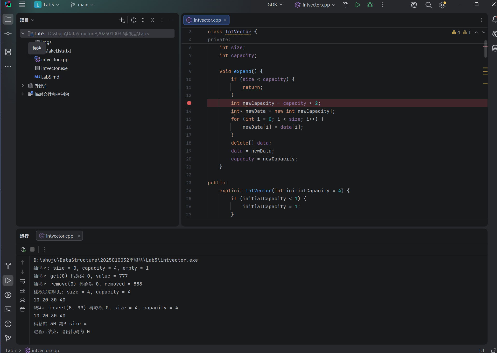
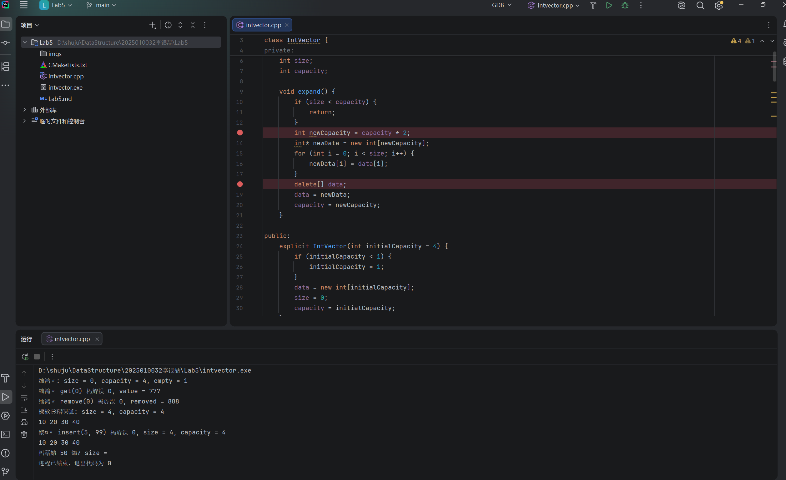
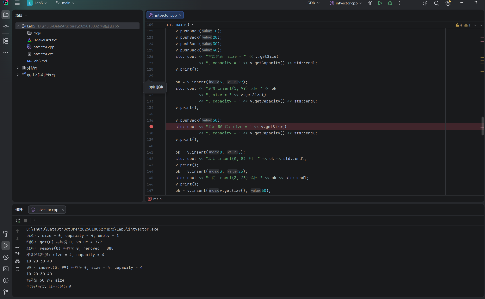

# Lab5：从固定容量类到 C++ 动态扩容向量

> **作业目标**：在 Lab4 的 `IntVector` 类基础上，把固定数组改为动态数组；区分 `size` 与 `capacity`；使用构造函数申请空间、析构函数释放空间；实现容量不足时扩大为原来两倍的 `expand()`，让原有接口继续工作；使用 CLion Memory View 截图验证扩容前后地址、数据和容量的关系。

---

## 一、配置 CMakeLists.txt

```cmake
cmake_minimum_required(VERSION 3.20)
project(Lab5 C CXX)

set(CMAKE_C_STANDARD 11)
set(CMAKE_CXX_STANDARD 17)

add_executable(lab5_cpp intvector.cpp)
```

---

## 二、intvector.cpp：完成动态整数向量

### 完整实现

```cpp
#include <iostream>

class IntVector {
private:
    int* data;
    int size;
    int capacity;

    void expand() {
        if (size < capacity) {
            return;
        }
        int newCapacity = capacity * 2;
        int* newData = new int[newCapacity];
        for (int i = 0; i < size; i++) {
            newData[i] = data[i];
        }
        delete[] data;
        data = newData;
        capacity = newCapacity;
    }

public:
    explicit IntVector(int initialCapacity = 4) {
        if (initialCapacity < 1) {
            initialCapacity = 1;
        }
        data = new int[initialCapacity];
        size = 0;
        capacity = initialCapacity;
    }

    ~IntVector() {
        delete[] data;
    }

    IntVector(const IntVector&) = delete;
    IntVector& operator=(const IntVector&) = delete;

    int getSize() const {
        return size;
    }

    int getCapacity() const {
        return capacity;
    }

    bool empty() const {
        return size == 0;
    }

    bool get(int index, int& value) const {
        if (index < 0 || index >= size) {
            return false;
        }
        value = data[index];
        return true;
    }

    int find(int value) const {
        for (int i = 0; i < size; i++) {
            if (data[i] == value) {
                return i;
            }
        }
        return -1;
    }

    bool insert(int index, int value) {
        if (index < 0 || index > size) {
            return false;
        }
        expand();
        for (int i = size - 1; i >= index; i--) {
            data[i + 1] = data[i];
        }
        data[index] = value;
        size++;
        return true;
    }

    bool remove(int index, int& removed) {
        if (index < 0 || index >= size) {
            return false;
        }
        removed = data[index];
        for (int i = index; i < size - 1; i++) {
            data[i] = data[i + 1];
        }
        size--;
        return true;
    }

    void pushBack(int value) {
        insert(size, value);
    }

    void print() const {
        for (int i = 0; i < size; i++) {
            if (i > 0) {
                std::cout << " ";
            }
            std::cout << data[i];
        }
        std::cout << std::endl;
    }
};

int main() {
    IntVector v;
    std::cout << "空表: size = " << v.getSize()
              << ", capacity = " << v.getCapacity()
              << ", empty = " << v.empty() << std::endl;

    int value = 777;
    bool ok = v.get(0, value);
    std::cout << "空表 get(0) 返回 " << ok << ", value = " << value << std::endl;
    int removed = 888;
    ok = v.remove(0, removed);
    std::cout << "空表 remove(0) 返回 " << ok << ", removed = " << removed << std::endl;

    v.pushBack(10);
    v.pushBack(20);
    v.pushBack(30);
    v.pushBack(40);
    std::cout << "首次装满: size = " << v.getSize()
              << ", capacity = " << v.getCapacity() << std::endl;
    v.print();

    ok = v.insert(5, 99);
    std::cout << "满表 insert(5, 99) 返回 " << ok
              << ", size = " << v.getSize()
              << ", capacity = " << v.getCapacity() << std::endl;
    v.print();

    v.pushBack(50);
    std::cout << "追加 50 后: size = " << v.getSize()
              << ", capacity = " << v.getCapacity() << std::endl;
    v.print();

    ok = v.insert(0, 5);
    std::cout << "表头 insert(0, 5) 返回 " << ok << std::endl;
    v.print();
    ok = v.insert(3, 25);
    std::cout << "中间 insert(3, 25) 返回 " << ok << std::endl;
    v.print();
    ok = v.insert(v.getSize(), 60);
    std::cout << "表尾插入 60 返回 " << ok << std::endl;
    v.print();
    std::cout << "再次装满: size = " << v.getSize()
              << ", capacity = " << v.getCapacity() << std::endl;

    ok = v.insert(4, 28);
    std::cout << "满表 insert(4, 28) 返回 " << ok
              << ", size = " << v.getSize()
              << ", capacity = " << v.getCapacity() << std::endl;
    v.print();

    ok = v.remove(0, removed);
    std::cout << "remove(0) 返回 " << ok << ", removed = " << removed << std::endl;
    v.print();
    ok = v.remove(3, removed);
    std::cout << "remove(3) 返回 " << ok << ", removed = " << removed << std::endl;
    v.print();
    ok = v.remove(v.getSize() - 1, removed);
    std::cout << "删除表尾 返回 " << ok << ", removed = " << removed << std::endl;
    v.print();
    std::cout << "删除后: size = " << v.getSize()
              << ", capacity = " << v.getCapacity() << std::endl;

    ok = v.get(3, value);
    std::cout << "get(3) 返回 " << ok << ", value = " << value << std::endl;
    std::cout << "find(30) = " << v.find(30) << std::endl;
    std::cout << "find(99) = " << v.find(99) << std::endl;

    value = 777;
    ok = v.get(v.getSize(), value);
    std::cout << "get(size) 返回 " << ok << ", value = " << value << std::endl;
    ok = v.get(-1, value);
    std::cout << "get(-1) 返回 " << ok << ", value = " << value << std::endl;
    removed = 888;
    ok = v.remove(v.getSize(), removed);
    std::cout << "remove(size) 返回 " << ok << ", removed = " << removed << std::endl;
    ok = v.remove(-1, removed);
    std::cout << "remove(-1) 返回 " << ok << ", removed = " << removed << std::endl;
    ok = v.insert(-1, 99);
    std::cout << "insert(-1, 99) 返回 " << ok << std::endl;
    std::cout << "非法操作后: size = " << v.getSize()
              << ", capacity = " << v.getCapacity() << std::endl;
    v.print();

    for (int i = 0; i < 6; i++) {
        v.remove(0, removed);
    }
    std::cout << "删除全部: size = " << v.getSize()
              << ", capacity = " << v.getCapacity()
              << ", empty = " << v.empty() << std::endl;
    v.pushBack(-1);
    std::cout << "清空后追加: size = " << v.getSize()
              << ", capacity = " << v.getCapacity() << std::endl;
    v.print();

    IntVector small(0);
    std::cout << "初始容量传 0: size = " << small.getSize()
              << ", capacity = " << small.getCapacity() << std::endl;
    small.pushBack(7);
    small.pushBack(7);
    std::cout << "small: size = " << small.getSize()
              << ", capacity = " << small.getCapacity() << std::endl;
    small.print();
    std::cout << "small.find(7) = " << small.find(7) << std::endl;

    IntVector negative(-3);
    std::cout << "初始容量传 -3: size = " << negative.getSize()
              << ", capacity = " << negative.getCapacity() << std::endl;
    std::cout << "v 仍为: ";
    v.print();
    std::cout << "各对象的 size: " << v.getSize()
              << ' ' << small.getSize()
              << ' ' << negative.getSize() << std::endl;

    return 0;
}
```

---

## 三、CLion Memory View 截图验证

### 3.6.2 三张截图的固定位置

**A．扩容前：`imgs/memory_before.png`**



**B．复制完成、尚未释放：`imgs/memory_copied.png`**



**C．扩容并追加完成：`imgs/memory_after.png`**



### 3.6.4 必填：Memory View 观察记录

| 记录项目 | 图 A：扩容前 | 图 B：复制完成 | 图 C：追加完成 |
| :--- | :--- | :--- | :--- |
| 当前 `data` 地址（图 C 为 `v.data`） | 0x0000024E8A0E4B50 | 0x0000024E8A0E4B50 | 0x0000024E8A0E4C10 |
| `newData` 地址 | 尚未申请，不填写 | 0x0000024E8A0E4C10 | 已离开作用域，不填写 |
| 当前对象的 `size` | 4 | 4 | 5 |
| 当前对象的 `capacity` | 4 | 4 | 8 |

- `sizeof(int)`：4 字节
- 容量为 `4` 时，整数元素存储区大小：16 字节
- 容量为 `8` 时，整数元素存储区大小：32 字节

如果 Memory View 在 `delete[]` 之后仍显示旧数组的字节，是否可以继续在程序中访问旧数组？说明理由。

> 在此填写你的回答（不少于 20 字）。

不可以继续访问旧数组。delete[] 已经将旧数组的内存释放还给操作系统，虽然 Memory View 可能仍显示残留字节，但该内存区域已不再属于当前程序，继续访问会导致未定义行为，可能读到脏数据或程序崩溃。

---

## 四、选择题与填空

### 4.1 `size` 与 `capacity`

某向量的 `size == 3`、`capacity == 8`，当前有效元素的下标范围是：

- [ ] A. `0` 到 `7`
- [x] B. `0` 到 `2`
- [ ] C. `0` 到 `3`
- [ ] D. `1` 到 `3`

### 4.2 动态数组的释放

执行 `int* p = new int[8];` 后，正确释放该数组的语句是：

- [ ] A. `delete p;`
- [ ] B. `free(p);`
- [x] C. `delete[] p;`
- [ ] D. `p = nullptr;`

### 4.3 初始容量为零

按照本次构造函数的约定，执行 `IntVector v(0);` 后应当得到：

- [ ] A. `size == 0`、`capacity == 0`
- [x] B. `size == 0`、`capacity == 1`
- [ ] C. `size == 1`、`capacity == 1`
- [ ] D. `size == 0`、`capacity == 4`

### 4.4 扩容的执行顺序

本次使用 `newData` 暂存新地址、使用 `data` 保留旧地址，正确的顺序是：

- [ ] A. 释放旧数组 → 申请新数组 → 从旧数组复制 → 更新指针和容量
- [ ] B. 更新 `capacity` → 直接向原数组新增的位置写入
- [x] C. 申请新数组 → 复制有效元素 → 释放旧数组 → 更新指针和容量
- [ ] D. 申请新数组 → 用新地址覆盖 `data` → 通过原来的 `data` 读取旧元素

### 4.5 扩容会不会增加元素个数

扩容前 `size == 4`、`capacity == 4`。`expand()` 刚执行完、插入操作还没有写入新元素时，应当是：

- [ ] A. `size == 4`、`capacity == 4`
- [ ] B. `size == 8`、`capacity == 8`
- [x] C. `size == 4`、`capacity == 8`
- [ ] D. `size == 5`、`capacity == 8`

### 4.6 为什么先检查下标

当 `size == capacity == 4` 时调用 `insert(5, 99)`，本次接口规定的结果是：

- [x] A. 返回 `false`，`size` 仍为 `4`，`capacity` 仍为 `4`
- [ ] B. 先扩容到 `8`，再返回 `false`
- [ ] C. 自动补上缺失元素后插入，返回 `true`
- [ ] D. 覆盖最后一个元素，返回 `true`

### 4.7 析构函数

对于 `main` 中的局部对象 `IntVector v;`，下列说法正确的是：

- [ ] A. 每调用一次 `remove`，都会自动执行一次析构函数
- [ ] B. 必须在 `main` 中手动调用析构函数，否则它永远不会执行
- [ ] C. 指针成员消失时，它指向的动态数组无需代码就会自动释放
- [x] D. 离开 `v` 所在作用域时自动执行析构函数，由本例函数体释放当前数组

### 4.8 禁止复制对象的原因

本次框架保留两行 `= delete`，主要是为了：

- [ ] A. 禁止创建两个独立对象
- [x] B. 避免直接复制指针后两个对象共用数组，造成失效访问或重复释放
- [ ] C. 让 `new[]` 自动变成 `delete[]`
- [ ] D. 禁止在扩容时复制整数元素

### 4.9 末尾追加的复杂度

设追加前有 `n` 个有效元素，采用本次的两倍扩容策略。正确的说法是：

- [ ] A. 每一次 `pushBack` 都是 `O(1)`，没有例外
- [ ] B. 每一次 `pushBack` 都必须复制全部元素，所以都是 `O(n)`
- [x] C. 发生扩容的单次追加为 `O(n)`；从空表连续追加时，每次均摊为 `O(1)`
- [ ] D. 只有随机输入的数据才能得到均摊 `O(1)`

### 4.10 扩容与中间插入

将固定数组改为动态数组后，在中间插入元素的最坏时间复杂度是：

- [ ] A. `O(1)`，因为可以自动扩容
- [x] B. `O(n)`，仍可能移动大量元素；扩容复制与右移两段线性工作相加仍为线性
- [ ] C. `O(log n)`，因为容量每次乘二
- [ ] D. `O(n²)`，因为存在扩容循环和插入循环

### 4.11 填空：程序运行验证

`intvector.cpp` 的实际运行输出是否与 3.5 的期望输出完全一致？

- [x] A. 一致
- [ ] B. 不一致

如果选择"不一致"，请说明哪一行不同以及原因：

> 在此填写原因，选择"一致"时填写"无"。

无

### 4.12 填空：容量变化记录

| 观察位置 | 操作后的 `size` | 操作后的 `capacity` | 本步扩容复制个数 |
| :--- | :---: | :---: | :---: |
| `IntVector v;` 创建后 | 0 | 4 | 0 |
| `v` 追加 `40` 后 | 4 | 4 | 0 |
| 满表 `v.insert(5, 99)` 失败后 | 4 | 4 | 0 |
| `v` 追加 `50` 后 | 5 | 8 | 4 |
| 满表 `v.insert(4, 28)` 后 | 9 | 16 | 8 |
| 六次删除完成、`v` 删除全部元素后 | 0 | 16 | 0 |

### 4.13 填空：解释扩容过程

用两三句话说明：为什么扩容时要先复制再释放旧数组？为什么扩容后不能直接把 `size` 设成 `capacity`？

> 在此填写你的回答（不少于 30 字）。

扩容时必须先复制再释放旧数组，因为旧数组是唯一保存有效数据的地方，如果先释放再复制就会读到已释放的内存导致未定义行为。扩容后不能直接把 size 设成 capacity，因为 capacity 只是数组总空间大小，实际有效元素个数仍然是原来那些，新空间是空位等待后续插入使用。
